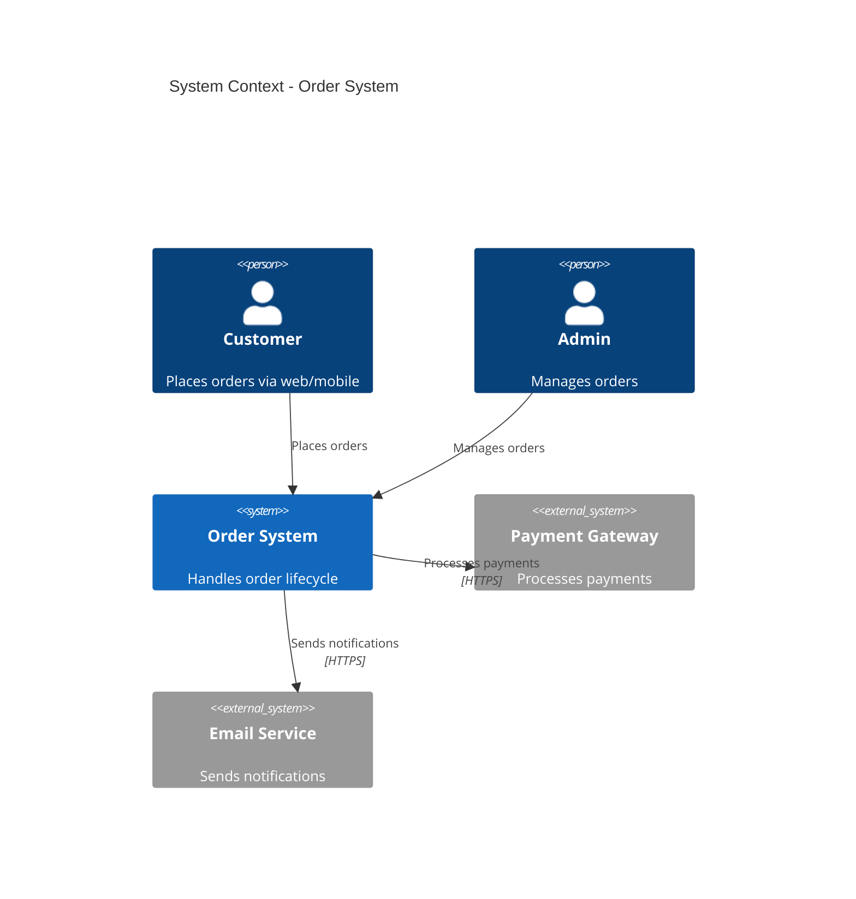
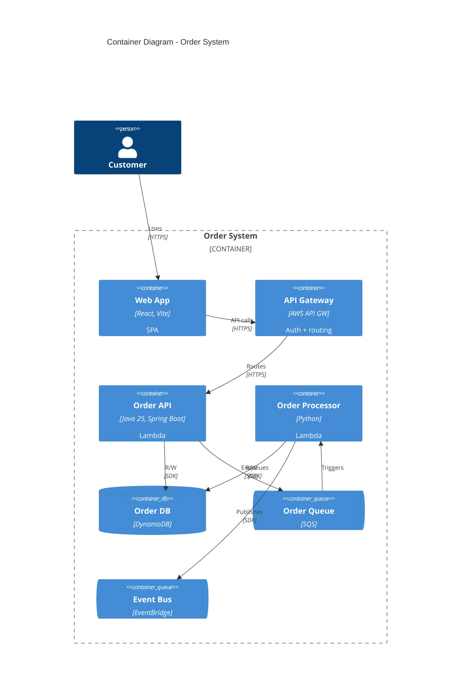
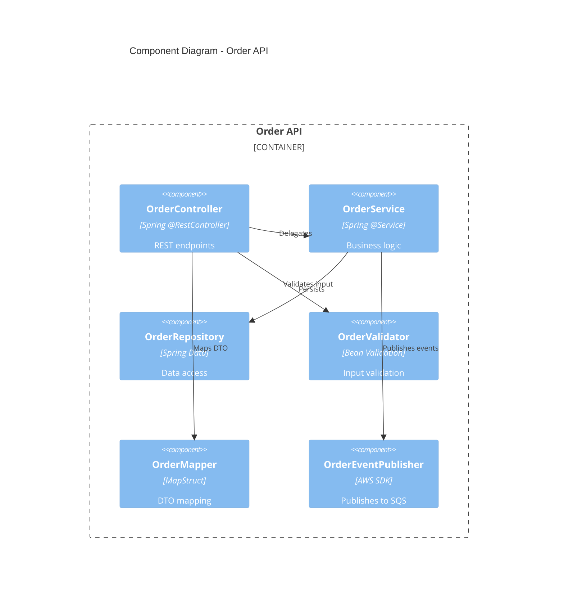

# Skill

---
name: c4-model
description: "C4 Model para documentação arquitetural: Context, Container, Component, Code. Diagramas com Structurizr DSL, PlantUML e Mermaid. Use quando documentar arquitetura ou criar diagramas."
---

# C4 Model — Architecture Documentation

Modelo C4 para documentacao arquitetural em 4 niveis de zoom.

## Os 4 niveis

| Nivel | O que mostra | Audiencia | Quando criar |
|-------|-------------|-----------|-------------|
| **1. Context** | Sistema + atores + sistemas externos | Todos (negocio, dev, ops) | Sempre |
| **2. Container** | Aplicacoes, databases, message brokers | Dev, Ops, Arquitetos | Sempre |
| **3. Component** | Componentes internos de um container | Dev do time | Quando modulo e complexo |
| **4. Code** | Classes, interfaces | Dev individual | Raramente (gera do codigo) |

## Nivel 1 — System Context

Mostra o sistema como caixa preta, seus usuarios e sistemas externos.

```
[Customer] --> [Order System] : Places orders
[Order System] --> [Payment Gateway] : Processes payments
[Order System] --> [Email Service] : Sends notifications
[Admin User] --> [Order System] : Manages orders
```

### Structurizr DSL

```
workspace {
    model {
        customer = person "Customer" "Places orders via web/mobile"
        admin = person "Admin" "Manages orders and inventory"

        orderSystem = softwareSystem "Order System" "Handles order lifecycle" {
            tags "Internal"
        }

        paymentGateway = softwareSystem "Payment Gateway" "Processes card payments" {
            tags "External"
        }
        emailService = softwareSystem "Email Service" "Sends transactional emails" {
            tags "External"
        }

        customer -> orderSystem "Places orders"
        admin -> orderSystem "Manages orders"
        orderSystem -> paymentGateway "Processes payments" "HTTPS/REST"
        orderSystem -> emailService "Sends notifications" "HTTPS/REST"
    }

    views {
        systemContext orderSystem "SystemContext" {
            include *
            autoLayout
        }
    }
}
```

### Mermaid



## Nivel 2 — Container

Mostra containers (aplicacoes, databases, filas) dentro do sistema.

### Structurizr DSL

```
workspace {
    model {
        customer = person "Customer"

        orderSystem = softwareSystem "Order System" {
            webapp = container "Web App" "React SPA" "TypeScript, Vite" {
                tags "Frontend"
            }
            apiGateway = container "API Gateway" "Routes and auth" "AWS API Gateway" {
                tags "AWS"
            }
            orderApi = container "Order API" "Order CRUD and business logic" "Java 25, Spring Boot" {
                tags "Lambda"
            }
            orderProcessor = container "Order Processor" "Async order processing" "Python" {
                tags "Lambda"
            }
            orderDb = container "Order Database" "Stores orders" "DynamoDB" {
                tags "Database"
            }
            orderQueue = container "Order Queue" "Async processing" "SQS" {
                tags "Queue"
            }
            eventBus = container "Event Bus" "Domain events" "EventBridge" {
                tags "Queue"
            }
        }

        customer -> webapp "Uses" "HTTPS"
        webapp -> apiGateway "API calls" "HTTPS"
        apiGateway -> orderApi "Routes" "HTTPS"
        orderApi -> orderDb "Reads/Writes" "AWS SDK"
        orderApi -> orderQueue "Enqueues" "AWS SDK"
        orderQueue -> orderProcessor "Triggers"
        orderProcessor -> orderDb "Reads/Writes" "AWS SDK"
        orderProcessor -> eventBus "Publishes events" "AWS SDK"
    }

    views {
        container orderSystem "Containers" {
            include *
            autoLayout
        }
    }
}
```

### Mermaid



## Nivel 3 — Component

Mostra componentes internos de um container.



## Regras e boas praticas

### O que incluir em cada nivel

| Nivel | Incluir | NAO incluir |
|-------|---------|-------------|
| Context | Personas, sistemas externos, relacoes de alto nivel | Detalhes tecnicos |
| Container | Apps, DBs, filas, protocolos | Classes, metodos |
| Component | Modulos/camadas dentro do container | Implementacao de metodos |
| Code | Classes, interfaces (quando necessario) | Tudo — gerar do codigo |

### Naming

- **Pessoas**: nome do papel, nao nome proprio ("Customer", nao "John")
- **Sistemas**: nome do produto ("Payment Gateway", nao "Stripe")
- **Containers**: nome funcional + tecnologia ("Order API — Java/Spring Boot")
- **Relacoes**: verbo + protocolo ("Sends orders via HTTPS")

### Anti-patterns

- Diagrama com mais de 20 elementos → esta no nivel errado
- Container sem tecnologia → informacao incompleta
- Relacao sem descricao → nao agrega valor
- Misturar niveis no mesmo diagrama → confuso
- Nivel 4 (Code) feito manualmente → desatualiza rapido

## Ferramentas

| Ferramenta | Formato | Versionavel | Renderizacao |
|------------|---------|-------------|-------------|
| **Structurizr DSL** | `.dsl` | Sim (texto) | Structurizr Lite/Cloud |
| **Mermaid** | Inline em `.md` | Sim (texto) | GitHub, GitLab, VS Code |
| **PlantUML** | `.puml` | Sim (texto) | Plugin IDE, CI |
| **draw.io** | `.drawio` | Parcial (XML) | draw.io |

**Recomendacao**: Structurizr DSL para documentacao formal, Mermaid para docs inline (README, ADRs).

## Onde colocar no projeto

```
.github/knowledge/docs-reference/architecture/
├── diagrams/
│   ├── workspace.dsl          # Structurizr DSL (fonte verdade)
│   ├── context.md             # Mermaid inline para README
│   ├── containers.md          # Mermaid inline para README
│   └── components/
│       ├── order-api.md
│       └── order-processor.md
└── adr/
    └── 0001-dynamodb-for-orders.md
```

## Checklist

- [ ] Nivel 1 (Context) existe e esta atualizado?
- [ ] Nivel 2 (Container) cobre todos os containers do sistema?
- [ ] Nivel 3 (Component) para modulos complexos?
- [ ] Diagramas versionados como codigo (DSL, Mermaid, PlantUML)?
- [ ] Cada elemento tem nome + tecnologia + descricao?
- [ ] Relacoes tem verbo + protocolo?
- [ ] Menos de 20 elementos por diagrama?
- [ ] Diagramas referenciados no README ou ADRs?

